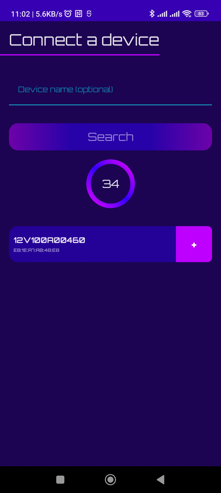
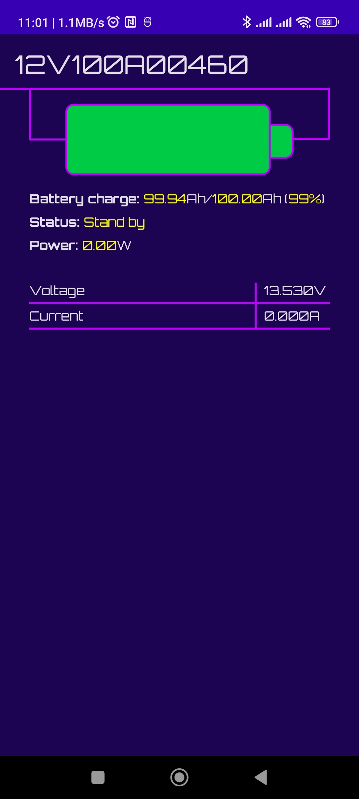

# VoltPolska

**THIS IS NOT AN OFFICIAL APP**

A reverse engineered app to connect to VoltPolska batteries with Bluetooth support. This project is made
fully for my personal purposes and just for fun. I have only one battery to test it so it's not guaranteed
to work on other models (although you can always reach me to point on problems).

**Use on your own risk, I'm not responsible for app/batteries malfunctions, incorrect data, and so on and so on.**

## Features

* Devices discovery/search
* Establishing connection with a battery
* Real-time updates of basic attributes such as voltage, current, available and total capacity, device status, etc.
* 🇺🇸 and 🇺🇦 locales.

## Installation

1. Clone this repository to your local machine
2. Open it in Android Studio
3. Build the project and install it to the connected device via USB or wireless debugging.

In case this thing is really needed to many people, I'll consider publishing in Play Store or some other
more convenient way of distribution.

## Screenshots

  <kbd></kbd>
  <kbd></kbd>

